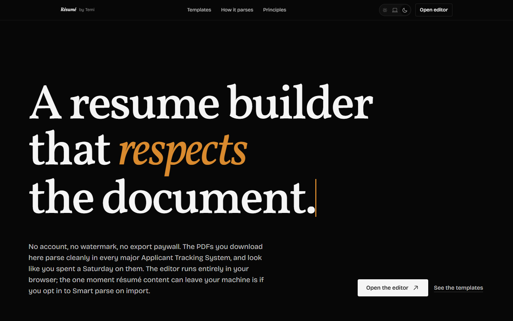
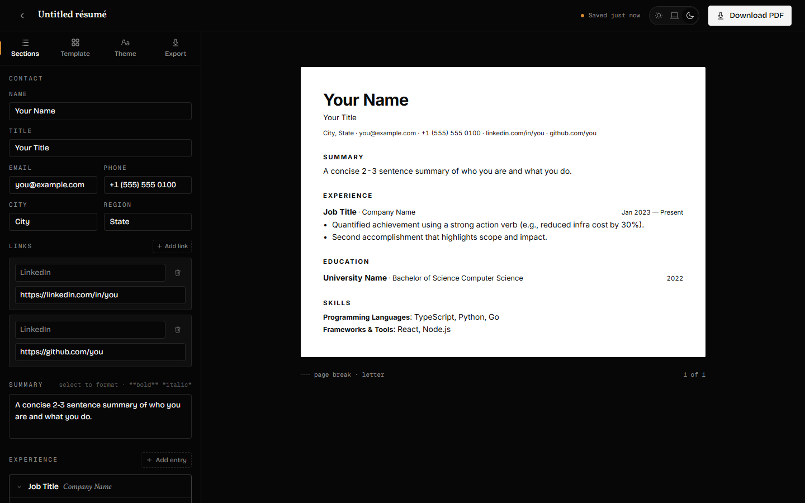
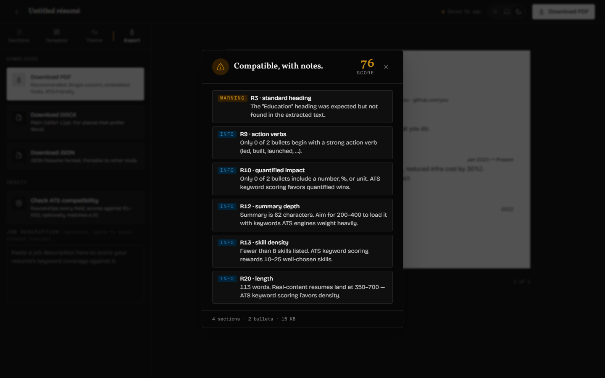
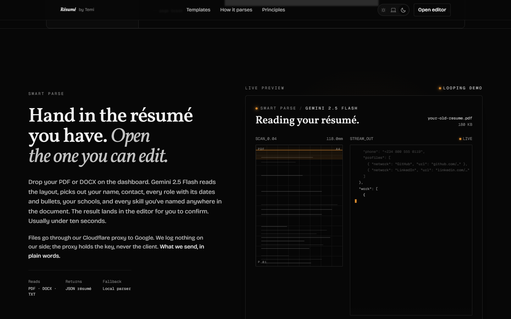
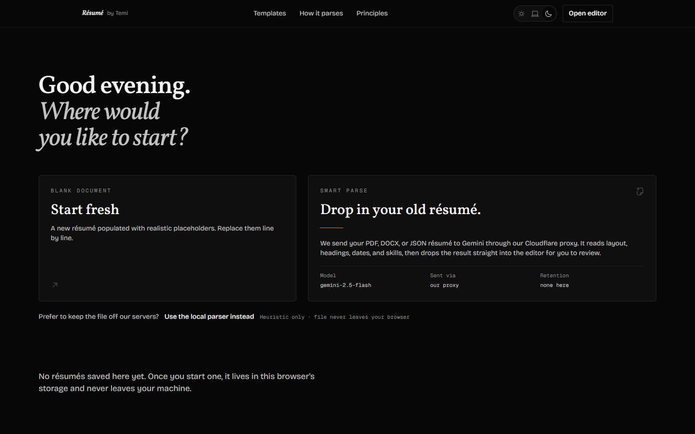
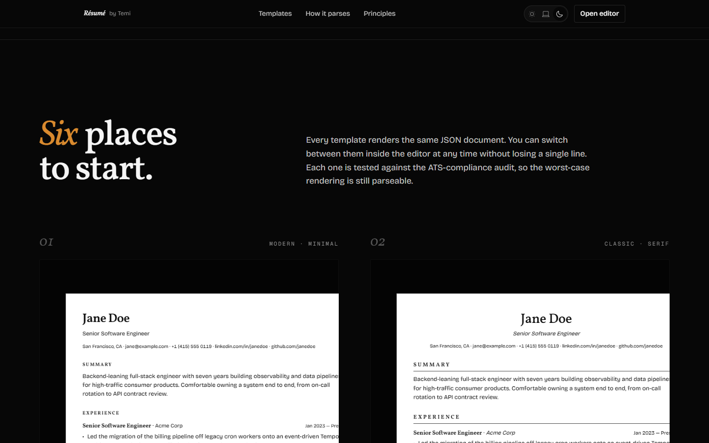
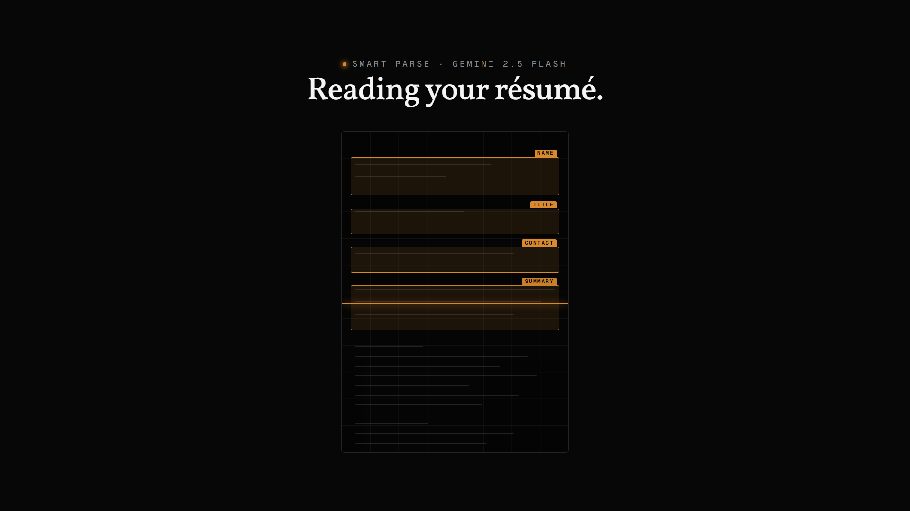

# Resume Builder

A free, no-account, privacy-first web app for building **100% ATS-friendly** résumés that don't look like everyone else's. Edit in your browser, export to vector PDF or DOCX, run an in-app ATS check, and (optionally) hand an old résumé to Gemini and walk into the editor with the work already done.

> No signup. No email gate. No watermark. No "upgrade to export." The editor is the product, not the funnel.



---

## What it does

| Capability | Notes |
|---|---|
| **WYSIWYG editor** | Sections / Template / Theme / Export tabs. Autosave to IndexedDB, undo / redo with keystroke grouping, Tiptap-powered rich text for summary and bullets, markdown round-trip on every field. |
| **Six templates** | Modern Minimal, Classic Serif, Tech Sans, Executive, Compact, Editorial. Each ships with its own typographic system; all six are single-column and pass the in-app ATS check. |
| **Live theming** | Heading font, body font, accent color, type scale, line height — all reactive on the live canvas through CSS custom properties. The PDF mirrors the canvas spacing exactly. |
| **Vector PDF export** | `@react-pdf/renderer` — real text in the content stream with ToUnicode CMaps, embedded fonts, single-column layout. Never image-based, never `html2canvas`. Each exported PDF also embeds an editable source copy, so re-importing it on the dashboard restores your template, fonts, and settings instantly — no re-parse. |
| **DOCX export** | Plain Calibri 11pt for places that prefer Word; ATS-safe by default. |
| **JSON Resume export / import** | Full round-trip with the JSON Resume schema. Files exported here carry a namespaced `meta.resumeBuilder` block (template + fonts + theme), so re-importing restores the exact formatting, not just the content — while staying valid JSON Resume for other tools. |
| **Smart parse** | Drop your old PDF / DOCX résumé on the dashboard, Google's Gemini reads the layout and prefills the editor. Local heuristic parser stays available for files you'd rather keep on-device. |
| **AI · Tailor to a job** | Paste a job description in the editor; accept/reject rewrites stream in to close the exact ATS gaps, the match score climbs as you accept, then apply them or save a separate tailored version. Grounded in your résumé — never fabricated. |
| **AI · Refine any field** | Under every summary, bullet, and description, a Refine control streams two sharper, ATS-friendly rewrites to choose from. |
| **24-rule ATS check** | Numeric score (0–100), per-rule findings, optional job-description keyword matching against a 510-entry skill taxonomy. Catches what Affinda / Jobscan / ResumeWorded catch. |
| **Multi-résumé dashboard** | Thumbnails, rename, duplicate, delete. Live previews reflect the actual stored content per card. |
| **Smooth scroll on landing surfaces** | Lenis on `/`, `/templates`, `/privacy`, `/about`. Disabled on the editor route (multiple nested scroll containers) and under `prefers-reduced-motion`. |

### A few screens

#### The editor



Sections on the left write straight to the live canvas on the right. Theme tab sliders move the canvas in the same direction the PDF will move (the canvas and PDF share the same per-template spacing scale through CSS custom properties).

#### ATS check



Generates the PDF, extracts the text layer with `pdfjs-dist`, round-trips every structured field (name, role, company, school, every skill keyword), and scores 24 rules including phrase voice, action-verb usage, quantification, date consistency, font embedding, PDF metadata, and JD keyword coverage when a job description is pasted in.

#### Smart parse demo (landing)



The landing page shows a live four-stage demo of the AI import flow — schematic document scan with detected-field overlays on the left, JSON token stream on the right, stage progress strip below. Editorial, deliberate; no sparkle, no purple gradient.

#### Multi-résumé dashboard



Start blank, or drop a PDF / DOCX / JSON Resume on the import card. Smart parse is the recommended path; the small "Use the local parser instead" link below the card runs a heuristic parser entirely in the browser for users who'd rather not involve Gemini.

#### Template gallery



Six templates, every variant designed to pass the ATS check by construction (single column, real text, embedded fonts, no decorative layout).

---

## Stack

| Layer | Choice | Notes |
|---|---|---|
| Build | Vite 7 (Rolldown) + React 19 + TypeScript 5.9 | Strict mode, project references |
| UI | Tailwind CSS v4 (CSS-first `@theme`) | OKLCH tokens, light + dark |
| Routing | TanStack Router | File-based, type-safe |
| State | Zustand + Immer + zundo | Undo/redo with keystroke grouping |
| Persistence | Dexie 4 | IndexedDB |
| Editor | Tiptap 2 | Per-field rich text with markdown round-trip |
| PDF | `@react-pdf/renderer` | Vector PDFs, embedded fonts |
| DOCX | `docx` (Dolan Miu) | Plain styled, ATS-friendly |
| AI (parse / tailor / refine) | Google Gemini (flash tier, with a flash-lite fallback) | Model pinned per feature in each `server/gemini-*.ts` core; routed through a deploy-target-agnostic proxy |
| Smooth scroll | Lenis | On marketing surfaces only; drives GSAP's ticker |
| 3D / scroll motion | GSAP + ScrollTrigger | Landing only — hero 3D stack, SmartParse 3D panel, pinned ATS scan ritual, pinned template coverflow |
| Fonts | Fontsource (self-hosted) | 9 catalog fonts for the resume canvas |
| Schema | Zod | Single source of truth for the `Resume` shape |
| Hosting | Cloudflare Workers + Static Assets *or* Vercel | Both supported on the same git branch |

---

## Folder structure

```
resume-builder/
├── api/                            Vercel serverless functions (auto-discovered)
│   └── parse-resume.ts             POST /api/parse-resume — Gemini proxy on Vercel
│
├── server/                         Non-browser code (Cloudflare + Vite dev + Vercel share this)
│   ├── gemini-parse.ts             Shared Gemini caller — model fallback, prompt, schema
│   ├── worker.ts                   Cloudflare Workers entry (wrangler.toml main)
│   └── parse-resume-dev-plugin.ts  Vite dev middleware mounting /api/parse-resume locally
│
├── functions/                      (unused; legacy Cloudflare Pages location, kept empty)
│
├── src/
│   ├── routes/                     TanStack Router file-based routes
│   │   ├── __root.tsx              Root layout (mounts smooth-scroll hook)
│   │   ├── index.tsx               / — Landing page
│   │   ├── app.tsx                 /app — Dashboard
│   │   ├── editor.$resumeId.tsx    /editor/:resumeId — Editor route
│   │   ├── editor/                 Editor sub-components (sidepanel, canvas, modals)
│   │   ├── templates/              /templates — Template gallery
│   │   ├── privacy.tsx, about.tsx  Static pages
│   │   └── -components/            Page-only components (TanStack `-` prefix)
│   │
│   ├── components/                 Cross-route components
│   │   ├── AiParseLoader/          Smart parse loader (scan panel + token stream + shell)
│   │   ├── MarkdownText/           Inline markdown renderer for the canvas
│   │   ├── ResumePreview/          The HTML resume canvas — single source of layout truth
│   │   ├── RichTextField/          Tiptap-backed RTE for bullets / summary
│   │   ├── SiteHeader/, SiteFooter/
│   │   └── …
│   │
│   ├── ui/                         Generic primitives (Button, MonthPicker)
│   ├── constants/                  Static data — variant styles, font catalog, skill taxonomy
│   ├── helpers/                    Pure utilities (resumeToFixture, parse-resume-text, …)
│   ├── hooks/                      Reusable hooks (useTheme, useSmoothScroll, …)
│   ├── interfaces/                 Cross-file object shapes (I-prefixed)
│   ├── types/                      Cross-file type aliases
│   ├── schema/                     Zod schemas — Resume is canonical
│   ├── store/                      Zustand store + autosave middleware
│   ├── db/                         Dexie schema + repository
│   ├── pdf/                        @react-pdf/renderer document + templates + ATS check
│   │   ├── ResumeDocument.tsx      Top-level PDF document
│   │   ├── templateStyles.ts       Per-template PDF spacing (mirrors src/constants/resume-variant-styles.ts)
│   │   ├── atsCheck.ts             24-rule ATS scoring
│   │   └── registerFonts.ts        Boot-time Font.register calls
│   ├── docx/                       docx export pipeline
│   ├── styles/                     globals.css (Tailwind v4 + tokens + utilities)
│   └── lib/                        Cross-cutting infrastructure (cn, etc.)
│
├── public/                         Static assets (favicon, fonts, robots.txt)
├── docs/screenshots/               README screenshots
├── tests/                          Playwright + Vitest tests
│
├── wrangler.toml                   Cloudflare deploy config
├── vite.config.ts                  Vite config + dev middleware registration
├── tsconfig*.json                  Project references (app, node)
├── .env.example                    Local env var template
└── package.json
```

---

## Getting started

```bash
pnpm install
cp .env.example .env       # paste your GEMINI_API_KEY into .env (optional, for Smart parse in dev)
pnpm dev                   # http://localhost:5173
```

Other scripts:

```bash
pnpm typecheck             # tsc -b --noEmit (project references)
pnpm test                  # vitest watch
pnpm test:run              # vitest single run
pnpm e2e                   # playwright
pnpm build                 # tsc -b && vite build → dist/
pnpm preview               # serve the production build
pnpm lint                  # eslint
pnpm format                # prettier --write
pnpm video:dev             # open the Remotion studio (preview the 30s demo)
pnpm video:render          # render the demo to out/demo.mp4
```

### Smart parse env

To run Smart parse end-to-end in `pnpm dev`, drop your Gemini key into `.env`:

```env
GEMINI_API_KEY=AIzaSy...your-key-here
```

Get a free-tier key at https://aistudio.google.com/apikey. **Do not prefix it with `VITE_`** — that would expose it in the browser bundle. Restart `pnpm dev` after editing `.env`.

Without a key set, Smart parse falls back to the local heuristic parser. The rest of the editor is unaffected.

---

## Architecture in one paragraph

Two render trees, one `Resume` data model. The on-screen preview (`src/components/ResumePreview/ResumePreview.tsx` driven by per-template Tailwind classes in `src/constants/resume-variant-styles.ts`) is HTML / CSS for editor responsiveness. The PDF export (`src/pdf/ResumeDocument.tsx` driven by `src/pdf/templateStyles.ts`) is a separate `@react-pdf/renderer` tree producing real vector text. Both consume the same `Resume` object validated by Zod, and both share user-controllable theme inputs (font, color, type scale, line height) through paired CSS variables on the canvas and inline style overrides on the PDF. The shared per-template numbers — section spacing, summary line-height, bullet line-height, inter-entry margins — are mirrored numerically between the two surfaces so the downloaded PDF matches what the user saw on canvas.

---

## AI features: how the proxy works

Three AI features — **Smart parse** (import), **Tailor to a job**, and per-field **Refine** — send content to Google's Gemini API through a server-side proxy that holds the API key. Three equivalent host wrappers exist; the project picks one based on where it's running. Each delegates to a shared core per feature (`server/gemini-parse.ts`, `server/gemini-tailor.ts`, `server/gemini-refine.ts`), which is also where each feature's exact model is pinned, so behaviour is identical across hosts. Endpoints: `POST /api/parse-resume`, `POST /api/tailor-resume` (NDJSON-streamed), `POST /api/refine-text` (streamed). Any new AI endpoint must mirror all three wrappers.

- **Cloudflare Workers + Static Assets** — `server/worker.ts` is the Worker entry declared in `wrangler.toml`. It routes `POST /api/parse-resume`, `/api/tailor-resume`, and `/api/refine-text` to their Gemini helpers and passes every other request through the `ASSETS` binding to the built SPA. Key from the `GEMINI_API_KEY` env binding in the Cloudflare dashboard.
- **Vercel** — `api/parse-resume.ts`, `api/tailor-resume.ts`, and `api/refine-text.ts` are Vercel serverless functions auto-detected from `api/`. Key from `GEMINI_API_KEY` in the Vercel project's env vars.
- **Local dev** — `server/parse-resume-dev-plugin.ts`, `server/tailor-resume-dev-plugin.ts`, and `server/refine-text-dev-plugin.ts` are Vite middleware handling the three routes. Key from `.env`.

Each host reads only its own config: Cloudflare follows `wrangler.toml` and ignores `api/`; Vercel scans `api/` and ignores `wrangler.toml`. The two production stacks can coexist on the same branch.

Without a key, the proxy returns a 500 and the client falls back to the local heuristic parser at `src/helpers/parse-resume-text.ts`.

---

## Deployment

### Cloudflare Workers + Static Assets

1. Connect the git repository as a Cloudflare Workers project. Cloudflare reads `wrangler.toml`, runs `pnpm build`, bundles `server/worker.ts`, and uploads `dist/` as static assets.
2. In the Cloudflare dashboard → your Worker → **Settings → Variables and secrets**, add:
   - `GEMINI_API_KEY` — your Gemini API key. Mark as a **Secret** (encrypted at rest).
   - `ALLOWED_ORIGINS` — comma-separated origins, e.g. `https://your-project.your-account.workers.dev,https://resume.yourdomain.com`. Recommended; if unset the proxy accepts any origin and your Gemini quota becomes available to anyone who finds the endpoint URL.
3. Trigger a redeploy after adding the variables so the bindings propagate.

If the build phase complains about `[ERR_PNPM_IGNORED_BUILDS]` for `workerd` or `sharp`, those are already approved in `pnpm-workspace.yaml`'s `onlyBuiltDependencies` and the next deploy should clear it.

### Vercel

1. Connect the same git repository as a separate Vercel project. Vercel auto-detects Vite, runs `pnpm build`, serves `dist/` with SPA fallback, and bundles `api/parse-resume.ts` as a Node serverless function on `/api/parse-resume`.
2. In the Vercel dashboard → **Project Settings → Environment Variables**, add:
   - `GEMINI_API_KEY` — your Gemini API key (mark as encrypted / sensitive).
   - `ALLOWED_ORIGINS` — same comma-separated origin list as above.
3. Redeploy after adding env vars so the function picks them up.

Both deploys can run in parallel — neither platform touches the other's config files.

---

## ATS-safety guarantees

The export pipeline is structured so producing an ATS-hostile PDF is impossible by construction:

- `@react-pdf/renderer` only — never `html2canvas`, `jspdf`, or any rasterizing pipeline. (A PreToolUse linting hook blocks those imports.)
- Single-column layout enforced at the primitive level. Templates restyle, never re-structure.
- Every catalog font is registered + embedded at boot via `src/pdf/registerFonts.ts`. The font catalog is curated; no system-font or runtime-loaded fonts.
- No decorative SVG icons in the resume body — only Unicode-safe text.
- The bundled ATS check (24 rules, see screenshot above) runs the same kinds of analysis paid services do — round-tripping every structured field through the extracted text, scoring action verbs / passive voice / quantification, validating fonts are embedded, and (optionally) matching against a pasted job description through a 510-entry canonical skill taxonomy.

---

## Privacy

The editor stays on your machine. Every keystroke is autosaved to IndexedDB on your device. PDF and DOCX are rendered in the same browser tab; no upload step.

The exceptions are the three **opt-in AI features** — Smart parse (import), Tailor to a job, and Refine — which send the content you choose (a file, or a field / your résumé plus a job description) to Google's Gemini API through our proxy. Each is something you start deliberately; the instant match score shown before you tailor is computed in your browser with no network call. We log nothing on our side; Google's retention policy applies to what they receive. A local-only heuristic parser remains available for import for users who'd rather not involve Gemini.

See the in-app `/privacy` page for the full disclosure.

---

## Demo video

A 30-second product demo lives in `remotion/`, built with [Remotion](https://www.remotion.dev). Seven scenes — intro, hook, smart-parse demo, editor, ATS check, privacy moment, closing — composed at 1920×1080 / 30fps. Same design language as the product (Vollkorn + Bricolage + Geist Mono, the deep amber accent, `easeOutExpo` motion).

```bash
pnpm video:dev              # open the Remotion studio for live preview
pnpm video:render           # render to out/demo.mp4 (~30s wall-clock for 30s of video on a modern laptop)
```

A still from the smart-parse scene (frame 270 of 900):



The scenes don't import the live product components — Remotion ships its own webpack bundler and Tailwind v4 / Lenis / motion-react don't compose cleanly into it. Instead each scene is a Remotion-native component that mirrors the product 1:1, using the same OKLCH tokens and font families. If you update the product's design tokens, mirror the change in `remotion/lib/tokens.ts`.

---

## Roadmap

- Slash menu (`/`) for inserting sections / entries / bullets
- Margin presets in the Theme tab
- Plain ATS Mode toggle
- Visual regression snapshots (template × paper size grid)
- PDF text round-trip e2e (the regression-killer test)
- v1.1: shareable link with zero-knowledge encryption, AI bullet rewrite, summary generation
- v1.2: industry-keyed skill weighting on top of the taxonomy

---

## License

MIT.
